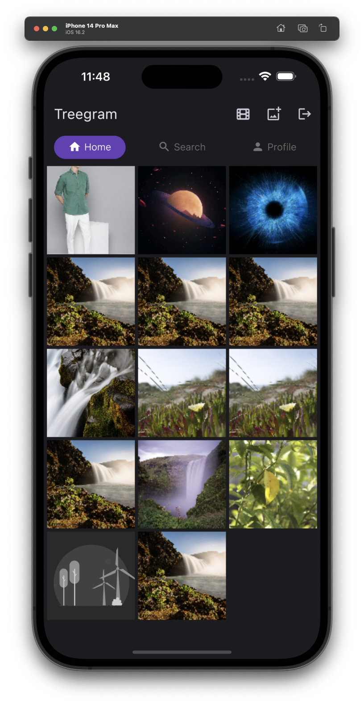
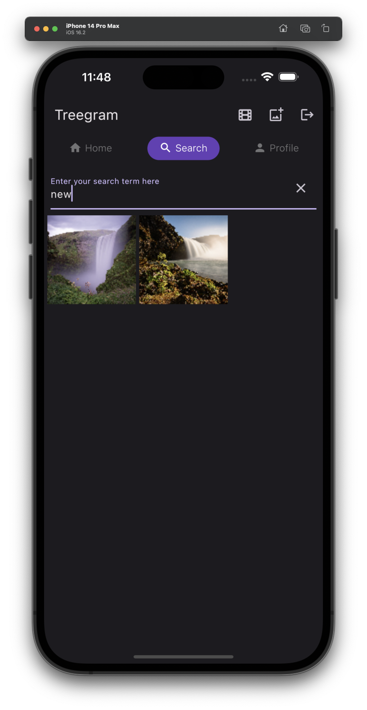

# treegram

A media sharing app in Flutter using Riverpod2 State Management

<table>
  <tr>
    <td align="center">Welcome</td>
     <td align="center">Home Screen</td>
     <td align="center">Search Screen </td>
  </tr>
  <tr>
    <td></td>
    <td></td>
    <td></td>
  </tr>
 </table>
  
 <table>
  <tr>
    <td align="center">Single Post View</td>
     <td align="center">Personal Posts</td>
     <td align="center">Upload Image</td>
  </tr>
  <tr>
    <td></td>
    <td></td>
    <td></td>
  </tr>
 </table>
  
 <table>
  <tr>
    <td align="center">Logout AlertBox</td>
     <td align="center">Video Post view</td>
     <td align="center">Custom Size Image</td>
  </tr>
  <tr>
    <td></td>
    <td></td>
    <td></td>
  </tr>
 </table>
  
 <table>
  <tr>
    <td align="center">Delete Post AlertBox</td>
     <td align="center">Share Post</td>
     <td align="center">Comments View</td>
  </tr>
  <tr>
    <td></td>
    <td></td>
    <td></td>
  </tr>
 </table>

## Getting Started

This project is a starting point for a Flutter application.

A few resources to get you started if this is your first Flutter project:

- [Lab: Write your first Flutter app](https://docs.flutter.dev/get-started/codelab)
- [Cookbook: Useful Flutter samples](https://docs.flutter.dev/cookbook)

For help getting started with Flutter development, view the
[online documentation](https://docs.flutter.dev/), which offers tutorials,
samples, guidance on mobile development, and a full API reference.
